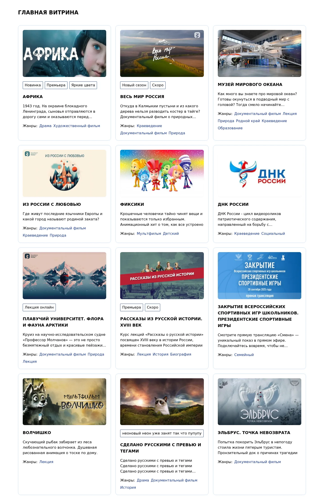
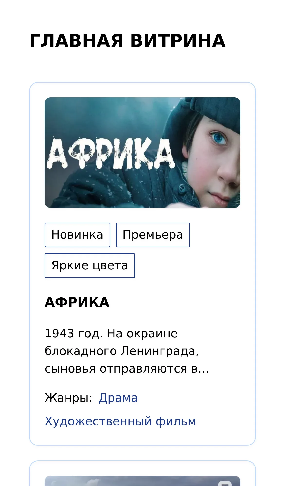

# cinema-test — витрина онлайн-кинотеатра на Nuxt 3

[English](README.md) | **Русский**

Главная страница онлайн-кинотеатра: сетка карточек с названием, описанием, картинкой, жанрами и метками. Данные приходят из CMS-API, ссылки на справочники (`genre:6`, `label:4`) заменяются самими объектами. Nuxt 3, TypeScript, Pinia, Tailwind CSS, SSR.

**Демо:** https://cinema-test-chi.vercel.app/

<p>
  
  
</p>

## Контекст

Это тестовое задание компании **Джаст Ворк** на позицию фронтенд-разработчика. ТЗ пришло 23 января 2026 года, собеседование было 30 января. Исходное решение — первые четыре коммита репозитория (28–30 января).

Задание («Задача 3»):

- создать проект на Nuxt 3 + Pinia и вывести данные витрины из `https://cms.test.ksfr.tech/api/v1/showcases/showcases/mainpage/web/`;
- ссылки на другие объекты вида `"genre:6"` (не только жанры) заменить самими объектами из справочников API ([swagger](https://cms.test.ksfr.tech/api/swagger/));
- вывести название, описание, картинку, список жанров и список меток;
- оформить сеткой карточек, адаптивной для мобильного и десктопа;
- решение «production-уровня», как старт проекта большого кинотеатра: для всех справочников, для любых страниц, в режимах SSR/SSG и SPA.

## Что сделано

- Главная страница с SSR: данные загружаются на сервере через `useAsyncData`, в браузер приходит готовый HTML.
- Справочники жанров и меток загружаются один раз в сторы Pinia и хранятся как словарь `oid → объект`. Маппер заменяет ссылки в слайдах объектами и отбрасывает ссылки, которых нет в справочнике.
- Ответ API и модель страницы разделены: отдельные типы DTO и доменные типы (`Banner`, `Genre`, `Label`, `MainPage`), `oid` типизированы шаблонными строками (`` `genre:${string}` ``).
- Адаптивная сетка карточек на Tailwind: 1 колонка на мобильном, 2 на планшете, 3 на десктопе. Длинное описание обрезается до трёх строк.

## Стек

| Область | Инструменты |
| --- | --- |
| Фреймворк | Nuxt 3, Vue 3 (`<script setup>`), TypeScript |
| Состояние | Pinia (setup-сторы) |
| Стили | Tailwind CSS 3 (`@nuxtjs/tailwindcss`) |
| Картинки | `@nuxt/image` |
| Качество кода | ESLint (`@nuxt/eslint`) |
| Хостинг | Vercel (SSR) |

## Архитектура

```
CMS API ──► services/api.ts ──► stores/genres.ts, stores/labels.ts   (справочники: oid → объект)
   │         (фолбэк на                          │
   │          data/snapshot/)                    ▼
   └──────► pages/index.vue ──► services/mappers/main-page.mapper.ts ──► components/card/banner.vue
            useAsyncData          DTO → MainPage, ссылки → объекты         карточка в сетке
```

1. [app.vue](app.vue) при старте загружает справочники: `fetchGenres()` и `fetchLabels()`.
2. Сторы [stores/genres.ts](stores/genres.ts) и [stores/labels.ts](stores/labels.ts) кладут их в словарь по `oid` и отдают через `getGenre(oid)` / `getLabel(oid)`. Флаги `loaded` / `loading` не дают загрузить справочник дважды, а состояние Pinia передаётся с сервера в браузер, поэтому на клиенте повторных запросов нет.
3. [pages/index.vue](pages/index.vue) через `useAsyncData` запрашивает витрину и передаёт сырой ответ в маппер.
4. [services/mappers/main-page.mapper.ts](services/mappers/main-page.mapper.ts) превращает `BannerDTO` в `Banner`: берёт название и синопсис, выбирает картинку и заменяет `oid` жанров и меток объектами из сторов.
5. [components/card/banner.vue](components/card/banner.vue) рисует карточку по доменной модели и ничего не знает о формате API.

Все запросы идут через [services/api.ts](services/api.ts) (см. следующий раздел).

## Устойчивость демо: снапшот API

API принадлежит тестовому стенду компании: он может отвечать нестабильно или исчезнуть совсем. Похожая история была в моём [vue2-project](https://github.com/BarbaraFromTonshaevo/vue2-project): учебное API там выключили, и я воспроизвела его контракт. Здесь я решила сделать страховку заранее.

- В [data/snapshot/](data/snapshot/) лежат реальные ответы трёх эндпоинтов: `mainpage`, `genres`, `labels`. Картинки баннеров скачаны в [public/snapshot/](public/snapshot/) (webp, около 0,5 МБ), и в снапшоте `resize_url` указывает на них. Остальные поля совпадают с ответом API.
- `fetchApi(path)` в [services/api.ts](services/api.ts) ходит в API с таймаутом. Если стенд не ответил или вернул ошибку, данные берутся из снапшота, а в лог сервера пишется предупреждение. Снапшот подгружается динамическим импортом, поэтому в основной бандл не попадает.
- Флаг `NUXT_PUBLIC_API_SNAPSHOT=true` включает снапшот принудительно, без обращения к API.
- Скрипт `npm run snapshot:update` заново снимает ответы и картинки, если стенд жив.

Ещё одна причина для снапшота: API отдаёт CORS-заголовок только для `https://test.ksfr.tech`. Поэтому из браузера на другом домене (localhost, Vercel) запросы к нему блокируются. В SSR это не мешает, так как запросы делает сервер. А в SPA-режиме страницу с чужого домена показывает именно снапшот.

Проверено во всех трёх режимах из ТЗ: SSR (`nuxt build`), SSG (`nuxt generate`) и SPA (`ssr: false`). В каждом случае рендерятся все 12 карточек с картинками, в том числе когда API недоступно.

## Ключевые решения

- **DTO отдельно от модели страницы.** Компоненты работают с `Banner`, а не с ответом API. Если формат API поменяется, правится только маппер.
- **Справочники нормализованы в Pinia.** Каждый справочник загружается один раз и хранится словарём по `oid`, поэтому замена ссылки на объект — это поиск по ключу, а не проход по массиву.
- **Отдельный слой маппинга** (`services/mappers/`). Преобразование данных не смешивается с запросами и шаблонами.
- **SSR через `useAsyncData`.** Страница приходит с данными, а состояние сторов переезжает на клиент через payload.

## Исправлено после собеседования

Я честно отмечаю, что изменила после 30 января, чтобы было видно, где исходное решение, а где доработка.

- **Картинки не выводились.** В карточке стоял несуществующий компонент `<NuxtImage>` вместо `<NuxtImg>`. Кроме того, `resize_url` в API — это шаблон с `{w}x{h}`, без подстановки размера сервер картинок отвечает ошибкой. Маппер теперь выбирает ассет типа `Banner` (раньше брался первый из списка, а там бывает скриншот или постер) и подставляет размер `800x450`. Заодно исправлено имя поля в типе: `asset_type` вместо `assets_type`.
- **Снапшот API и фолбэк** (раздел выше), адрес API и таймаут вынесены в `runtimeConfig`.
- Скрипты `lint`, `lint:fix` и `snapshot:update`, файл `.env.example`, этот README и скриншоты.

## Запуск

Нужен Node.js 20+.

```bash
npm install
npm run dev          # http://localhost:3000
```

Другие скрипты:

```bash
npm run build            # SSR-сборка в .output/
npm run preview          # запуск собранного приложения
npm run generate         # статическая генерация (SSG)
npm run lint             # ESLint
npm run snapshot:update  # обновить снапшот API и картинок
```

Переменные окружения необязательны, значения по умолчанию заданы в [nuxt.config.ts](nuxt.config.ts), пример лежит в [.env.example](.env.example):

| Переменная | По умолчанию | Назначение |
| --- | --- | --- |
| `NUXT_PUBLIC_API_BASE` | `https://cms.test.ksfr.tech/api/v1/` | базовый URL API |
| `NUXT_PUBLIC_API_SNAPSHOT` | `false` | `true` — всегда брать данные из снапшота |
| `NUXT_PUBLIC_API_TIMEOUT` | `3000` | сколько миллисекунд ждать API перед фолбэком |

## Демо

Приложение развёрнуто на Vercel в SSR-режиме (пресет Nitro для Vercel подключается автоматически). Сборка стандартная: `nuxt build`, без дополнительных настроек.

## Что бы улучшила при большем времени

ТЗ просило решение «для всех справочников и любых страниц». Сейчас оно работает для главной страницы и двух справочников, которые на ней встречаются. Вот что я бы сделала дальше:

- **Универсальный резолвер ссылок.** В API восемь справочников (`genres`, `labels`, `countries`, `studios`, `jobs`, `kind`, `rewards`, `seo`). Вместо стора на каждый справочник — один стор `metadata`, который загружает справочник по префиксу `oid`, и рекурсивный резолвер, который проходит по любому ответу и заменяет строки вида `тип:id` объектами. Тогда новая страница или новый справочник не потребуют правок маппера.
- **Прокси к API через серверные маршруты Nitro** (`/api/**` → стенд). Это решает проблему CORS в SPA-режиме, прячет адрес стенда и позволяет кешировать справочники на сервере.
- **Обработка ошибок и состояния загрузки.** Показывать `error` из `useAsyncData` и сбрасывать `loading` в сторах через `try/finally`. Сейчас, если запрос справочника упадёт мимо фолбэка, стор останется в состоянии `loading`.
- **Параллельная загрузка справочников** через `Promise.all` вместо двух последовательных `await`.
- **Строгая типизация маппера.** Сейчас он принимает `any`, поэтому TypeScript не заметил, что поле `Banner.url` не заполняется, а `filter(Boolean)` оставляет в типе `null`.
- **Ссылки карточек.** В ответе API есть `url` фильма или сериала, но все карточки ведут на `/`. Нужны страницы контента.
- **Метки с градиентом.** API отдаёт для меток цвета `left_color` / `center_color` / `right_color`, а сейчас метки рисуются простой рамкой.
- **Стили.** В `assets/css/main.css` синтаксис Tailwind 4 (`@import "tailwindcss"`), а подключён Tailwind 3, и файл нигде не используется. Классы `w-250` / `h-200` существуют только в Tailwind 4, поэтому на вёрстку не влияют.
- **SEO и доступность.** `<title>`, `lang`, мета-описание.
- **Тесты.** Юнит-тесты маппера и сторов на данных снапшота.
